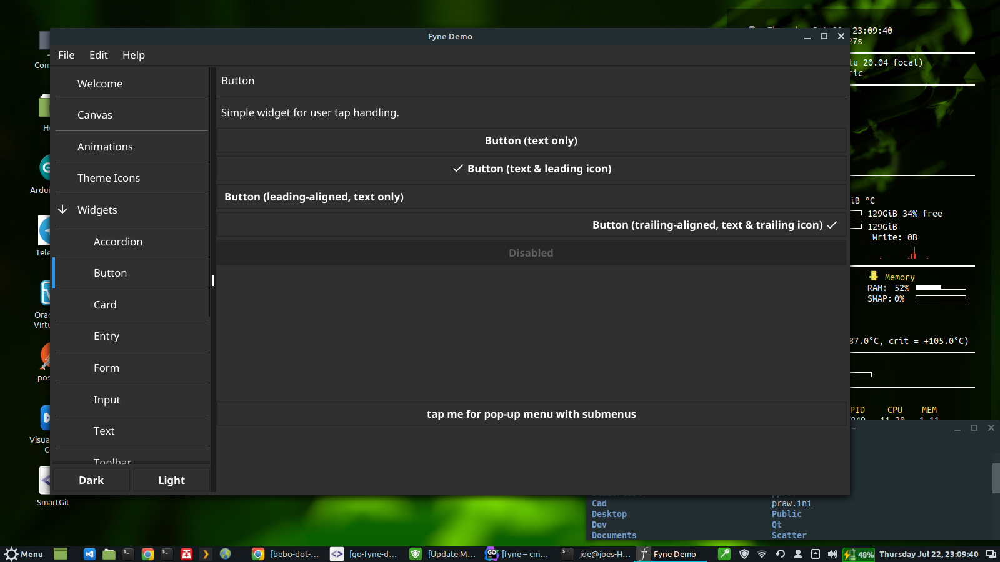
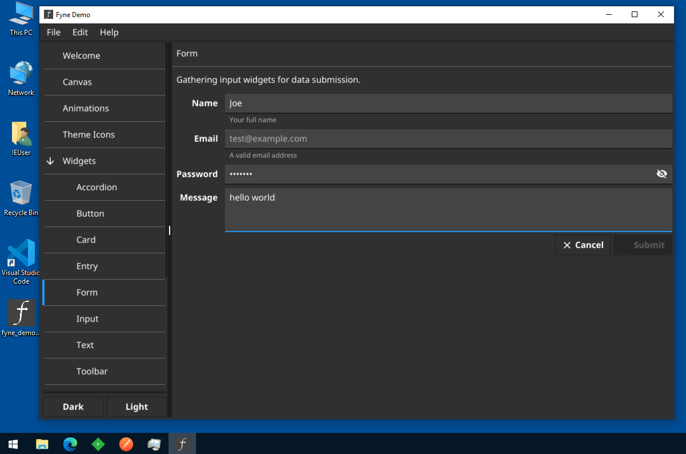
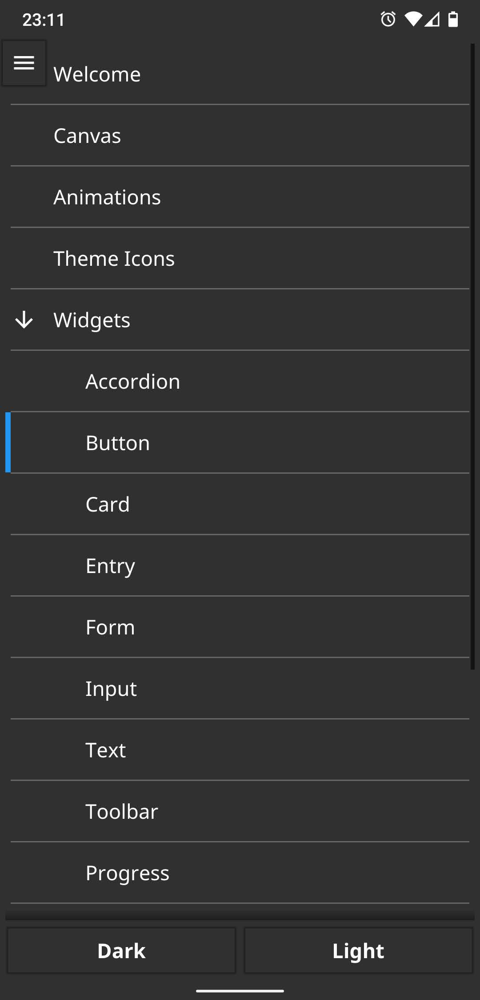

# go-fyne-demo

A proof of concept repo that demonstrates the cross compilation abilities of [fyne.io]((https://github.com/fyne-io/fyne))

## fyne.what?
**[fyne.io](https://github.com/fyne-io/fyne)** is a cross platform UI framework for Go. Currently at v2 fyne is now reasonably complete and stable. It is arguably more complete than other go UI toolkits. fyne is [nicely documented](https://developer.fyne.io/).

## Cross Platform Support
fyne v2 cross compiles to these operating systems:
* darwin
* linux
* windows
* android
* ios
* freebsd

## Goal
This repo demonstrates the [fyne_demo sample app](https://github.com/fyne-io/fyne/tree/master/cmd/fyne_demo) cross compiled for:
* linux amd64 (https://github.com/bebo-dot-dev/go-fyne-demo/tree/main/linux-amd64)
* windows amd64 (https://github.com/bebo-dot-dev/go-fyne-demo/tree/main/windows-amd64)
* android arm64 (https://github.com/bebo-dot-dev/go-fyne-demo/tree/main/android)

cross compilation to these target operating systems was performed on Linux Mint 20.2 x64 with [fyne-cross](https://github.com/fyne-io/fyne-cross)

I would have also cross compiled to ios but I don't have a mac so I'm unable to do that (more details in [prerequisites](https://developer.fyne.io/started/#prerequisites))

## Screenshots

### linux

### windows

### android

